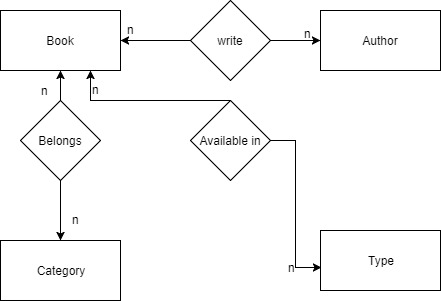

# Exercise 2

### Description

Create Database structure to organize the digital library.

### Analysis

To better understand the structure, I will design a relational database, which can be done in three steps:

1. Entity-Relational diagram
2. SQL diagram
3. Optimized SQL diagram

The image below is a very basic example of an ER diagram for this example. All entities will have their corresponding attributes, but they are not shown in the diagram for simplicity.

### Task list

- [x] ER diagram
- [ ] SQL diagram
- [ ] Optimized SQL diagram

### Possible improvements

Create the corresponding SQL diagram. For now I will leave the task to an ORM framework :)
